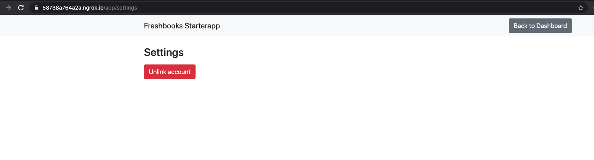

# FreshBooks Integrations Starter App

The NodeJS Starter is a pre-configured `ExpressJS` app to quickly build FreshBooks integrations.

### Installation

Clone / fork the repo and install dependencies:

```shell
$ git clone git@github.com:freshbooks/api-nodejs-starterapp.git
$ cd api-nodejs-starterapp

```

### Configure with your credentials

* [ngrok](https://ngrok.com/) is recommended for the Redirect URI
```shell
ngrok http 9999
Grab the url from the output, something like https://<random_characters>.ngrok.io
```
* Create an app using following the steps outlined in the [API docs](https://www.freshbooks.com/api/start)
    * The redirect_uri should be the `ngrok` url from above in the form `https://<random_characters>.ngrok.io/auth/freshbooks/redirect`
    * Required App Scopes
        * user:profile:read
        * user:billable_items:read
        * user:invoices:read
        * user:payments:read
* Additionally the `app` uses the [FreshBooks Node SDK](https://github.com/freshbooks/freshbooks-nodejs-sdk) 
    * The SDK is now in npm, however please make sure you use the versions `"@freshbooks/api": "^3.0.0" and "@freshbooks/app": "^3.0.0"`
* Create a `.env` file in the root of your project or rename & replace the vars in the provided `sample.env` file with your actual values

```
touch .env
CLIENT_ID=...
CLIENT_SECRET=...
REDIRECT_URI=https://<random_characters>.ngrok.io/auth/freshbooks/redirect
SESSION_SECRET=...
PORT=...
MONGODB_URI=mongodb://MONGODB_HOST:MONGODB_PORT
```

**The redirect URI configured for the app created  must match the Redirect URI variable otherwise an "Invalid URI" error will be reported**

### Build and Run

* The app uses mongoDB for persisting user data
* The environment is bootstrapped with `docker-compose + Makefile`
* You may simply do `make up` which will start the `app` + `mondoDB` ready to accept requests

### App Structure

* Home - https://<random_characters>.ngrok.io
    * Hit `Get Started` to Auth with FreshBooks
    
    
* Dashboard - https://<random_characters>.ngrok.io/app/dashboard
    * List of your invoices, items and payments from FreshBooks
    
    
* Settings - https://<random_characters>.ngrok.io/app/settings
    * `Unlink` to disconnect your `app`
    
    

### Contributing
You are very welcome to add/improve functionality . Please open a PR and submit a reasonable description about why it 
is needed